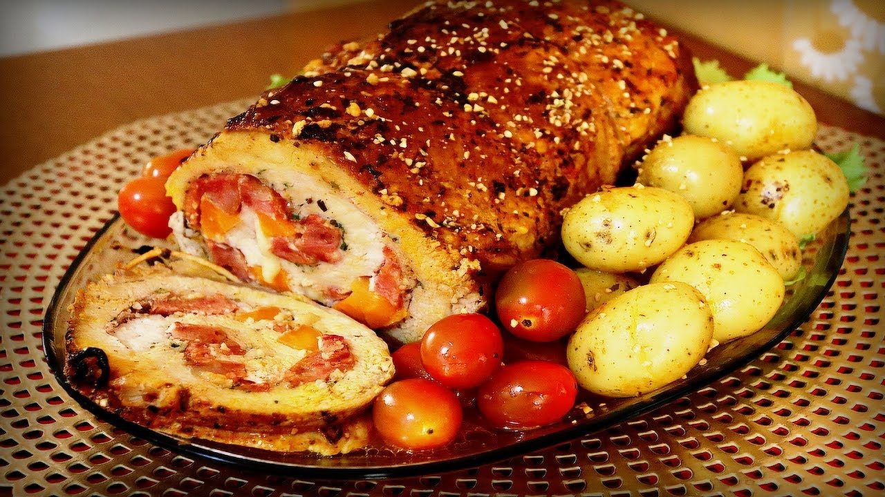

<html lang="en">
<head>
    <meta charset="UTF-8">
    <meta name="viewport" content="width=device-width, initial-scale=1.0">
    <link rel="stylesheet" href="receita.css">
</head>
</html>
<body>
<main class="conteudo">
<section class="introducao">
    <h1>ℝ𝔼ℂ𝔼𝕀𝕋𝔸🍽</h1>
    
𝔽𝔸𝕃𝕃𝕃𝔸𝔸𝔸 𝔾𝔸𝕃𝔼ℝ𝕀ℕℍ𝔸!!!! ℍ𝕠𝕛𝕖 𝕧𝕒𝕞𝕠𝕤 𝕝𝕙𝕖 𝕖𝕟𝕤𝕚𝕟𝕒𝕣 𝕔𝕠𝕞𝕠 𝕗𝕒𝕫𝕖𝕣 𝕃𝕠𝕞𝕓𝕠 ℝ𝕖𝕔𝕙𝕖𝕒𝕕𝕠 (com calabresqa)ദ്ദി ˉ͈̀꒳ˉ͈́ )✧ 

    
</section>

<section class ble =>
<h2>Modo de preparo : 1h⊹ ࣪ ˖⏱ ୭˚. ᵎ</h2>
<h3>Ingredientes (12 porções)</h3>

1 - Passe no liquidificador 1 tomate grande, 3 cebolas grandes , alhos vinagre e sal a gosto.

2 - Reserve.

3 - Em um recipiente coloque o lombo e perfure todo, faça um buraco no lombo e introduza a linguiça.

4 - Jogue o liquido do liquidificador e deixe descansar por 30 minutos.

5 - Em uma panela coloque o óleo, alho, cebola, tomate, pimentão, corante, tempero e louro. (Como se fosse temperar normalmente.)

6 - Despeje o lombo e o liquido do recipiente que ficou descansando o lombo dentro da panela.

7 - Cozinhe na pressão até ficar macio.

8 - Depois coloque numa travessa e deixe dourar no forno com batatas.

9 - Pronto é só saborear.

<footer class="rodape">
    

        
𝒞𝐻𝐸𝐹𝐸𝒮: 𝑀𝒶𝓇𝒸𝒾𝒶𝓃𝑒 & 𝔅𝔢𝔞𝔱𝔯𝔦𝔷(╥﹏╥)

        
Bₒₘ, ₒbgd ₚₑₗₐ ₐ ₐₜₑₙçãₒ ₑ ₑₛₚₑᵣₒ qᵤₑ cₒₙₛᵢgₐₘ fₐzₑᵣ ₑₛₛₐ dₑₗᵢcᵢₒₛₐ ᵣₑcₑᵢₜₐ ᵤwᵤ YYYYYₑₑₑₑₑₑₑ˙𐃷˙

        
&copy; 2025 - Todos os direitos reservados.

    

</footer>
